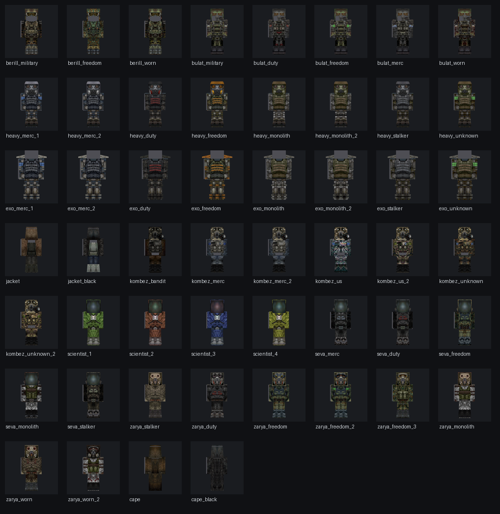

# STALKER Armor — мод брони для Minecraft 1.20.1 (Forge)

Мод добавляет **52 комплекта брони из вселенной S.T.A.L.K.E.R.** с полностью
кастомными 3D-моделями (не ванильные «коробки»): шлемы с противогазами, рюкзаки,
наплечники, капюшоны и рамы экзоскелетов.



## Комплекты

| Семейство | Варианты | Уровень |
|---|---|---|
| **Берилл-5М** | армейский, «Свобода», изношенный | выше железа |
| **Булат** | армейский, «Долг», «Свобода», наёмник, изношенный | как алмаз |
| **Тяжёлая броня (СКАТ)** | наёмник ×2, «Долг», «Свобода», «Монолит» ×2, сталкер, неизвестная | как алмаз + стойкость |
| **Экзоскелет** | те же 8 вариантов (рама поверх брони, без шлема и ботинок) | топ-тир, сопротивление отбрасыванию |
| **СЕВА** | наёмник, «Долг», «Свобода», «Монолит», сталкер | средний+ |
| **Заря** | сталкер, «Долг», «Свобода» ×3, «Монолит», изношенная ×2 | средний+ |
| **Научный костюм** | зелёный, коричневый, синий, оливковый | средний+ |
| **Комбинезон** | бандит, наёмник ×2, US ×2, неизвестный ×2 | средний |
| **Куртка / Плащ** | кожаная, чёрная / сталкерский, чёрный | как кожа |

Всего **190 предметов**. Всё есть в креативной вкладке «Броня сталкера» и крафтится
(кожа → кожа/железо → алмазы по уровню брони).

## Установка

1. Установите **Minecraft 1.20.1** и **Forge 47.2.0+**.
2. Положите `stalkerarmor-1.20.1.jar` из [Releases] или из папки `dist/` в папку `mods`.
3. Запустите игру.

## Сборка из исходников

```bash
gradle build        # нужен Gradle 8.1+ и JDK 17
```

Готовый jar: `build/reobfJar/output.jar` (или `build/libs`).
При каждом пуше GitHub Actions собирает мод автоматически (см. вкладку Actions).

## Как это устроено

- `armor MODEL/` — **исходные OBJ-модели по частям тела** (риг: 1 юнит = 4 юнита Minecraft).
  Мод использует их **напрямую, без изменений**: они кладутся в jar как есть
  (`assets/stalkerarmor/geo/original/`), а перевод в координаты модели игрока
  (пивоты, зеркалирование, отступ от скина) выполняется в рантайме.
- `armor TEX/` — текстуры 512×512 (по одной на вариант).
- `tools/gen_assets.py` — генерация иконок предметов, лангов, рецептов и таблицы сетов
  (иконки рендерятся из тех же исходных OBJ).
- `src/main/java/com/stalkerarmor/` — код мода: загрузка OBJ, рендер мешей через
  `getHumanoidArmorModel` + `getArmorTexture` (Forge 1.20.1), анимации модели
  игрока (ходьба, присед, поворот головы) наследуются автоматически.

Чтобы добавить новую броню: положите OBJ в `armor MODEL`
(`arm_<family>_<part>.obj`, part = head/chest/arm/leg/boot) и текстуру в `armor TEX`,
добавьте строку в таблицу `SETS` в `tools/gen_assets.py` и запустите
`python3 tools/gen_assets.py all`.
